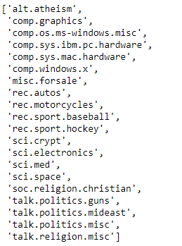

# End-to-End ML Process with Newsgroups Dataset

## Business Understanding

The Newsgroups Dataset is a collection of newsgroup posts originally collected around 1995. While the backend code implementation is fairly different, we can think of them as like the Reddit posts of 1995, where a "category" in this dataset is like a subreddit.

The task is to try to identify the category where a post was published, based on the text content of the post.

## Data Understanding

### Data Source

Part of what we are practicing here is using the sklearn.datasets submodule, which you have seen before (e.g. the Iris Dataset, the Wine Dataset). We can see a full list of available dataset loaders here.

In this case we will be using the fetch_20newsgroups function (documentation here). An important thing to note is that because this is text data, scikit-learn actually downloads a set of documents to the computer we are using to complete this lab, rather than just loading data into memory in Python.

### Features

Prior to preprocessing, every row in the dataset only contains one feature: a string containing the full text of the newsgroup post. We will perform preprocessing to create additional features.

### Target

As one might have guessed based on the function name, there are 20 categories in the full dataset. Here is a list of all the possible classes:

This full dataset is quite large. To save us from extremely long runtimes, we'll work with only a subset of the classes. For this lab, we'll work with the following five:

`comp.windows.x`
`rec.sport.hockey`
`misc.forsale`
`sci.crypt`
`talk.politics.misc`

### Steps

#### 1. Load the Data

Use pandas and sklearn.datasets to load the train and test data into appropriate data structures. Then get a sense of what is in this dataset by visually inspecting some samples.

#### 2. Perform Data Cleaning and Exploratory Data Analysis with nltk

Standardize the case of the data and use a tokenizer to convert the full posts into lists of individual words. Then compare the raw word frequency distributions of each category.

#### 3. Build and Evaluate a Baseline Model with TfidfVectorizer and MultinomialNB

Ultimately all data must be in numeric form in order to be able to fit a scikit-learn model. So we'll use a tool from sklearn.feature_extraction.text to convert all data into a vectorized format.

Initially we'll keep all of the default parameters for both the vectorizer and the model, in order to develop a baseline score.

#### 4. Iteratively Perform and Evaluate Preprocessing and Feature Engineering Techniques

Here we will investigate three techniques, to determine whether they should be part of our final modeling process:

Removing stopwords
Using custom tokens
Domain-specific feature engineering
Increasing max_features

5. Evaluate a Final Model on the Test Set
Once we have chosen a final modeling process, we'll fit it on the full training data and evaluate it on the test data.

